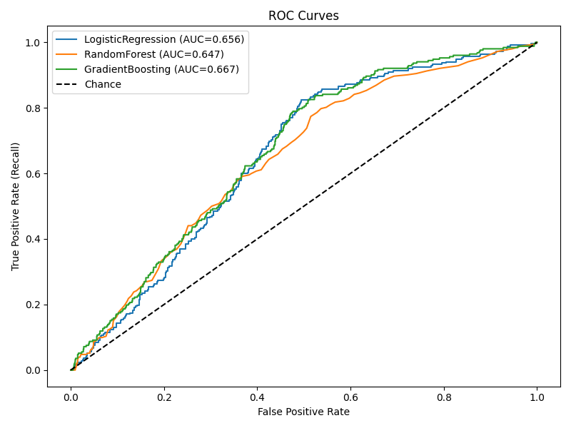
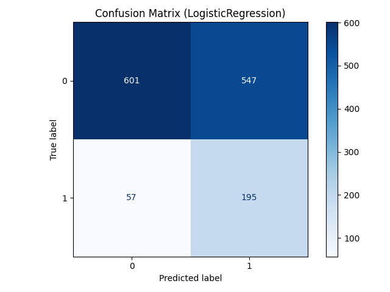
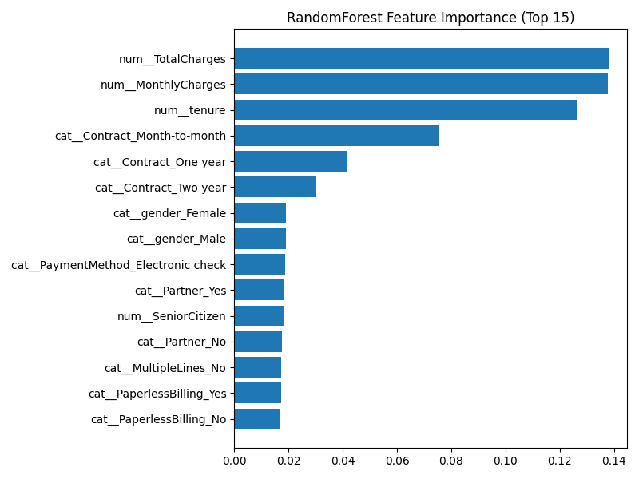

# Customer Churn Prediction

## Project Overview
Predict customer churn (binary classification) using customer and usage data.  
This project demonstrates an end-to-end data science pipeline: data acquisition, exploratory data analysis, feature engineering, model training & evaluation, explainability, and exporting results for business use.

## Aim
Build a reproducible churn prediction pipeline that:
- identifies customers at high risk of leaving,
- provides interpretable feature explanations for business stakeholders,
- produces model artifacts, evaluation metrics, and visualizations suitable for demo and interviews.

## Dataset
Primary (recommended): **Telco Customer Churn** — public dataset commonly used for churn problems (CSV).  
- **Instructions:** download the dataset CSV and place it as `data/processed/customer_churn.csv` in this project folder.  
Fallback: the repository includes a small generator script (`00_get_data.py`) that creates a realistic synthetic dataset if you cannot access the public CSV.

## Business Problem
- Reduce customer churn by proactively engaging high-risk customers.
- Provide features and model explanations so marketing/sales can design targeted retention campaigns.

## Approach (high level)
1. Data acquisition (load CSV or generate synthetic).  
2. Exploratory data analysis (EDA) to understand distributions and missingness.  
3. Feature engineering (categorical encoding, scaling, temporal / aggregate features).  
4. Model training & selection (Logistic Regression baseline, RandomForest/LightGBM as stronger models).  
5. Model evaluation (ROC AUC, PR AUC, confusion matrix, calibration).  
6. Explainability (SHAP or feature importances) and simple dashboard-ready visuals.  
7. Export deliverables (model artifact, `reports/` with metrics & plots, `models/`).

## Files in this project
- `00_get_data.py` — download public CSV if available, otherwise generate synthetic dataset (writes to `data/processed/customer_churn.csv`).  
- `01_eda.ipynb` — interactive notebook with EDA and charts (optional: `.py` alternative).  
- `02_preprocessing.py` — feature engineering & preprocessing (outputs `features/` files).  
- `03_train_model.py` — training scripts (saves `models/best_model.joblib` and `reports/metrics.csv`).  
- `04_evaluate_visuals.py` — evaluation plots (ROC, PR, confusion matrix) saved to `reports/visuals/`.  
- `requirements.txt` — Python dependencies for reproducibility.  
- `reports/` — outputs: metrics, prediction CSVs, and visuals.  
- `models/` — saved model artifacts.

## How to run 
```bash
# from project folder
pip install -r requirements.txt

# 1) get data (downloads if available or generates a synthetic CSV)
python 00_get_data.py

# 2) exploratory analysis (run the notebook or script)
jupyter notebook 01_eda.ipynb
# or
python 01_eda.py

# 3) preprocessing (creates feature files)
python 02_preprocessing.py

# 4) train models (saves model & metrics)
python 03_train_model.py

# 5) evaluate & generate visuals
python 04_evaluate_visuals.py
```

## Deliverables
- `reports/metrics.csv` — model performance metrics (ROC AUC, accuracy, precision, recall, F1)  
- `reports/visuals/` — ROC curve, PR curve, confusion matrix, feature importance visuals (PNG)  
- `reports/predictions.csv` — test set predictions with probability and label  
- `models/best_model.joblib` — trained model artifact ready for demo/serving

## Results

The models were evaluated on the test set to predict customer churn.  

### Model Performance

| Model              | Accuracy | Precision | Recall | F1     | ROC_AUC |
|--------------------|----------|-----------|--------|--------|---------|
| LogisticRegression | 0.569    | 0.263     | 0.774  | 0.392  | 0.656   |
| RandomForest       | 0.813    | 0.333     | 0.040  | 0.071  | 0.647   |
| GradientBoosting   | 0.817    | 0.357     | 0.020  | 0.038  | 0.667   |

**Interpretation:**  
- Logistic Regression achieved the **highest recall (77%)**, meaning it captures most churn cases.  
- Tree-based models (RandomForest, GradientBoosting) achieved **higher accuracy (>81%)** but recall is low, so they miss many churners.  
- In a business setting, **recall is more important** (better to flag at-risk customers, even if some false positives).  

### Evaluation Visuals

- **ROC Curves** — show tradeoff between sensitivity and specificity across models.  
  

- **Confusion Matrix (LogisticRegression)** — confirms that Logistic Regression correctly identifies many churners, though with some false positives.  
  

- **Feature Importance (Tree-based models)** — highlights key drivers of churn (e.g., contract type, monthly charges, tenure).  
  

### Interpretation & Business Use
- Provide top features driving churn (via feature importances) to marketing for targeted interventions.
- Use predicted churn probabilities to rank customers for retention campaigns (saved in reports/predictions.csv).

### Next steps

- Add cost-sensitive learning or uplift modeling to measure business ROI of interventions.
- Build a small dashboard (Power BI / Streamlit) to serve predictions to business users.
