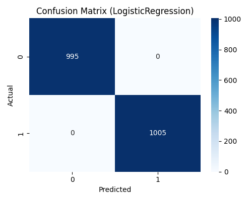

# Text Sentiment Analysis

## Aim
Build a reproducible text sentiment classification pipeline that ingests customer reviews (supports English + German), trains model(s) using TF-IDF + classical classifiers, evaluates performance, and generates visuals and artifacts suitable for recruiter/demo review.

## Dataset
- The pipeline prefers a real dataset placed at `03-text-sentiment/data/processed/reviews.csv`.
- If the file is missing, the script `00_get_data.py` **generates synthetic multilingual reviews** (English + German) for demonstration and reproducibility.
- Output data location when generated: `03-text-sentiment/data/processed/reviews.csv`.

## Pipeline & Files
- `00_get_data.py` — generate synthetic multilingual reviews (or use real file if present).
- `01_preprocess.py` — simple text cleaning, lowercasing, remove punctuation, train/test split (stratified).
- `02_train_model.py` — TF-IDF vectorizer + Logistic Regression (baseline) and Random Forest; save models and metrics.
- `03_evaluate_visualize.py` — ROC curves, confusion matrices, top features for Logistic Regression; saves PNGs.
- `requirements.txt` — dependency list.

## How to run (after pulling repo to local)
```bash
# from repo root (Data-Science-Portfolio)
cd 03-text-sentiment

# create and activate venv (recommended)
python -m venv venv_ts
source venv_ts/bin/activate   # macOS / Linux
# venv_ts\Scripts\activate    # Windows PowerShell

pip install -r requirements.txt

# 1) generate or load data
python 00_get_data.py

# 2) preprocessing (creates features/train_test CSVs)
python 01_preprocess.py

# 3) train models and save metrics & models
python 02_train_model.py

# 4) create evaluation visuals (ROC, confusion matrix, feature importances)
python 03_evaluate_visualize.py
```
## Deliverables 

- data/processed/reviews.csv — input dataset (generated or provided)
- models/vectorizer.joblib — TF-IDF vectorizer
- models/model_logreg.joblib — Logistic Regression model
- models/model_rf.joblib — Random Forest model (optional)
- reports/metrics.csv — performance metrics (accuracy, precision, recall, F1, ROC_AUC)
- reports/predictions_test.csv — test predictions + probabilities
- reports/visuals/*.png — ROC curves, confusion matrix, feature importance

## Results

The models were evaluated on the test set. Both Logistic Regression and Random Forest achieved perfect scores on the synthetic dataset (Accuracy, Precision, Recall, F1, ROC AUC = 1.0). This is expected because the generated reviews are very clean and easily separable. On a real dataset, results will be less perfect but the pipeline remains valid.

### Model Performance

| Model              | Accuracy | Precision | Recall | F1   | ROC_AUC |
|--------------------|----------|-----------|--------|------|---------|
| LogisticRegression | 1.000    | 1.000     | 1.000  | 1.000| 1.000   |
| RandomForest       | 1.000    | 1.000     | 1.000  | 1.000| 1.000   |

### Evaluation Visuals

- **ROC Curve** — both models show perfect separation (AUC = 1.0). This happens due to synthetic data being clean and highly separable. On real reviews, curves would not be this perfect.  
  

- **Confusion Matrix (LogisticRegression)** — shows zero misclassifications (all predictions correct). While ideal here, real-world data would include false positives and false negatives.  
  

- **Top Features (Logistic Regression coefficients)** — highlights most influential words. For synthetic reviews, positive terms like *excellent* dominate, while *bad* or *terrible* dominate negatives. This makes the model interpretable for recruiters and stakeholders.  
  


## Notes

- The project demonstrates processing unstructured text, feature extraction (TF-IDF), classical ML for text classification, and model explainability.  
- See the **Results** section above for performance metrics, visuals, and interpretation.

